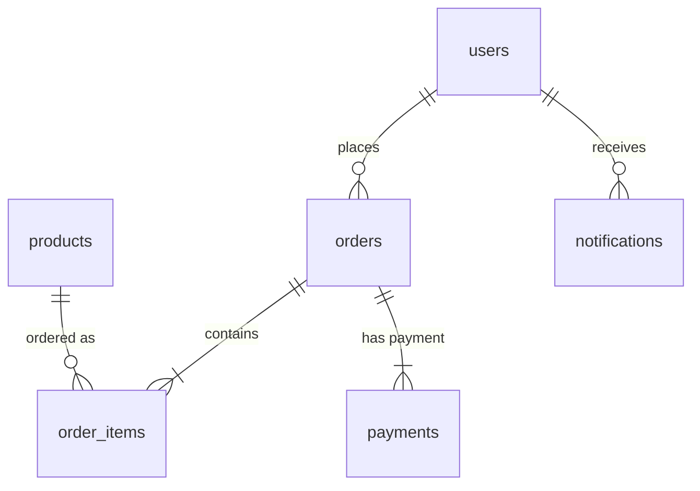

## 1. User Service

**Purpose:**
Handles user registration, authentication, and profile management.

**Tables:**

- **users**Stores core user details.

  ```
  user_id         UUID (Primary Key)
  username        VARCHAR(150) UNIQUE
  email           VARCHAR(254) UNIQUE
  password        VARCHAR(128)
  created_at      TIMESTAMP
  updated_at      TIMESTAMP
  ```
- **user_profiles** (Optional)
  Stores additional user information.

  ```
  profile_id      UUID (Primary Key)
  user_id         UUID (Foreign Key → users)
  first_name      VARCHAR(30)
  last_name       VARCHAR(150)
  phone_number    VARCHAR(20)
  created_at      TIMESTAMP
  updated_at      TIMESTAMP
  ```

---

## 2. Product Service

**Purpose:**
Manages product listings and inventory.

**Tables:**

- **products**Main product information.

  ```
  product_id      UUID (Primary Key)
  name            VARCHAR(255)
  description     TEXT
  price           DECIMAL(10,2)
  inventory       INTEGER
  created_at      TIMESTAMP
  updated_at      TIMESTAMP
  ```
- **categories**
  Product classification.

  ```
  category_id     UUID (Primary Key)
  name            VARCHAR(100)
  parent_id       UUID (Foreign Key → categories, nullable)
  created_at      TIMESTAMP
  ```

---

## 3. Cart Service

**Purpose:**
Manages temporary shopping cart data.

**Data Structure (Redis):**

```
Key format: cart:{user_id}
Data type: Hash
Fields:
- product_id (String) → quantity (Integer)
```

---

## 4. Order Service

**Purpose:**
Handles order processing and history.

**Tables:**

- **orders**Order header information.

  ```
  order_id        UUID (Primary Key)
  user_id         UUID
  total           DECIMAL(12,2)
  status          VARCHAR(20)
  created_at      TIMESTAMP
  ```
- **order_items**
  Order line items.

  ```
  item_id         UUID (Primary Key)
  order_id        UUID (Foreign Key → orders)
  product_id      UUID
  quantity        INTEGER
  price           DECIMAL(10,2)
  created_at      TIMESTAMP
  ```

---

## 5. Payment Service

**Purpose:**
Processes payment transactions.

**Tables:**

- **payments**
  Payment records.
  ```
  payment_id      UUID (Primary Key)
  order_id        UUID
  amount          DECIMAL(12,2)
  status          VARCHAR(20)
  gateway         VARCHAR(50)
  transaction_id  VARCHAR(255)
  created_at      TIMESTAMP
  ```

---

## 6. Notification Service

**Purpose:**
Manages user notifications.

**Tables:**

- **notifications**
  Notification records.
  ```
  notification_id UUID (Primary Key)
  user_id         UUID
  type            VARCHAR(20)
  subject         VARCHAR(200)
  message         TEXT
  status          VARCHAR(20)
  created_at      TIMESTAMP
  sent_at         TIMESTAMP
  ```

---

## Key Implementation Details

1. **Database per Service**Each service has its own PostgreSQL database except Cart Service (Redis)
2. **UUID Primary Keys**All tables use UUIDv4 for identifiers
3. **Status Fields**Use ENUM-like string values:

   - Order status: ['created', 'paid', 'shipped', 'delivered', 'cancelled']
   - Payment status: ['pending', 'completed', 'failed', 'refunded']
   - Notification status: ['pending', 'sent', 'failed']
4. **Audit Fields**All tables include `created_at` timestamps, mutable tables include `updated_at`
5. **Price Precision**

   - Products: DECIMAL(10,2) ($999,999.99 max)
   - Orders: DECIMAL(12,2) ($99,999,999.99 max)

---

## Service Relationships



---

## Schema Considerations

1. **Data Isolation**Services only access their own databases
2. **Eventual Consistency**Uses async messaging (RabbitMQ) for cross-service updates
3. **Redis Structure**Cart data format:

   ```json
   {
     "user_id": "550e8400-e29b-41d4-a716-446655440000",
     "items": {
       "product_1": 2,
       "product_5": 1
     }
   }
   ```
4. **Indexes**

   - users: email, username
   - products: name, price
   - orders: user_id, status
   - payments: order_id, status

This schema supports:

- Independent service scaling
- High transaction volume
- Flexible payment gateway integration
- Real-time inventory management
- Comprehensive order tracking
