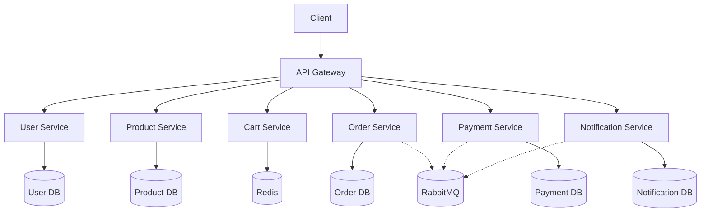

    

# E-Commerce Platform with Microservices Architecture


A scalable e-commerce platform built using microservices architecture and Docker. Each component runs as an independent service, allowing for easy scaling and maintenance.

## Features

- **User Management**: Registration, authentication, and profile management
- **Product Catalog**: CRUD operations for products with inventory tracking
- **Shopping Cart**: Redis-backed cart system with real-time updates
- **Order Processing**: Order creation, tracking, and history
- **Payment Integration**: Multiple payment gateways (Stripe, PayPal)
- **Notifications**: Email, SMS, and push notifications
- **API Gateway**: Unified entry point with Nginx

## Technologies

- **Core**:
  
  
  
- **Databases**:
  
  
- **Infrastructure**:
  
  
  

## Getting Started

### Prerequisites

- Docker 23.0+
- Docker Compose 2.17+
- Python 3.9+

### Installation

1. **Clone the repository**
   ```bash
   git clone https://github.com/yourusername/ecommerce-microservices.git
   cd ecommerce-microservices
   ```


2. **Set up environment variables**

   ```bash
   cp .env.example .env
   # Update values in .env file
   ```
3. **Build and start containers**

   ```bash
   docker-compose up --build -d
   ```
4. **Run database migrations**

   ```bash
   docker-compose exec user-service python manage.py migrate
   docker-compose exec product-service python manage.py migrate
   docker-compose exec order-service python manage.py migrate
   docker-compose exec payment-service python manage.py migrate
   docker-compose exec notification-service python manage.py migrate
   ```

### Service Endpoints

| Service              | Port | Endpoints                             |
| -------------------- | ---- | ------------------------------------- |
| API Gateway          | 80   | Routes to all services                |
| User Service         | 8001 | `/users/register`, `/users/login` |
| Product Service      | 8002 | `/products/`, `/products/{id}/`   |
| Cart Service         | 8003 | `/cart/`, `/cart/clear/`          |
| Order Service        | 8004 | `/orders/`, `/orders/{id}/`       |
| Payment Service      | 8005 | `/payments/process/`                |
| Notification Service | 8006 | `/notifications/`                   |

## Architecture



## Development

### Running Tests

```bash
docker-compose exec user-service python manage.py test
docker-compose exec product-service python manage.py test
# Repeat for other services
```

### Scaling Services

```bash
docker-compose up -d --scale user-service=3 --scale product-service=3
```

### Monitoring

Access RabbitMQ Management UI:

```
http://localhost:15672 (guest/guest)
```

## Environment Variables

| Variable               | Description        | Example               |
| ---------------------- | ------------------ | --------------------- |
| `SECRET_KEY`         | Django secret key  | (random 50 chars)     |
| `DB_HOST`            | Database host      | `product-db`        |
| `STRIPE_SECRET_KEY`  | Stripe API key     | `sk_test_...`       |
| `TWILIO_ACCOUNT_SID` | Twilio account SID | `AC...`             |
| `SMTP_HOST`          | Email server host  | `smtp.sendgrid.net` |

## Contributing

1. Fork the repository
2. Create your feature branch (`git checkout -b feature/AmazingFeature`)
3. Commit your changes (`git commit -m 'Add some AmazingFeature'`)
4. Push to the branch (`git push origin feature/AmazingFeature`)
5. Open a Pull Request
